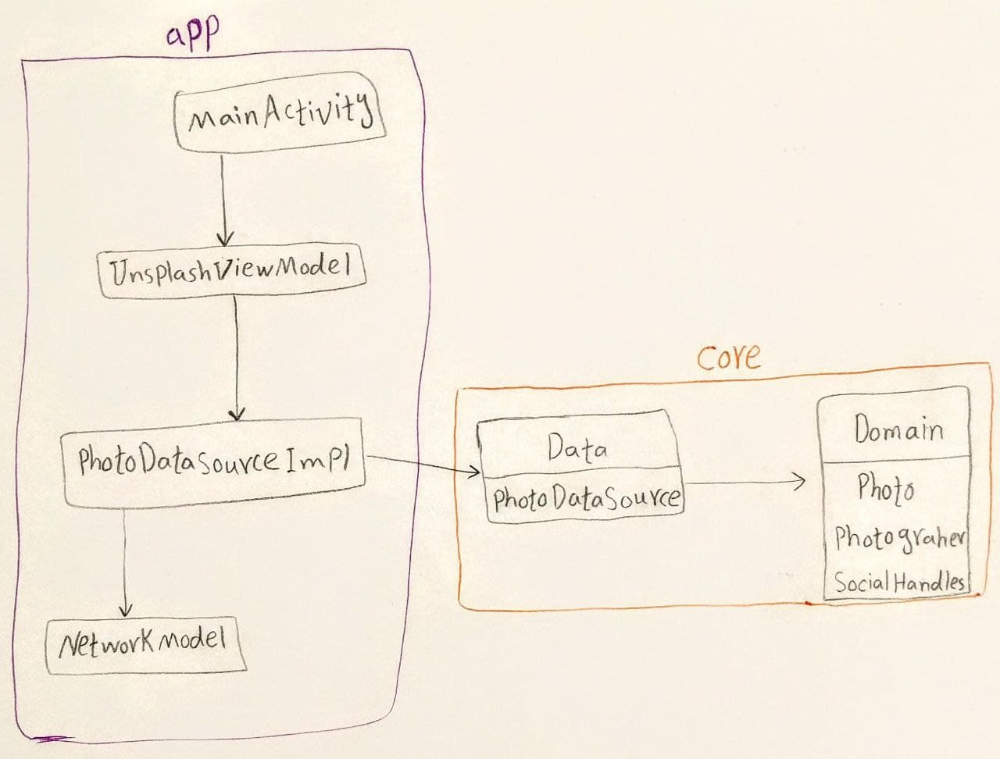

3rd party app to access all the services of <a href="https://unsplash.com/">Unsplash</a> web server.

------------------------------------------

## Architecture:

The current architecture of this app is a mixture of Clean architecture and MVVM. The diagram below shows it clearly 👇👇

As it's obvious in the diagram above, in the `domain` layer we define all the objects that will be used in the context of our app (in this example they are `Photo`, `Photographer`, and `SocialHandles`).
The `DataSource` interfaces defined in `data` layer provide functions to work on those objects.
`DataSourceImpl` implements the previously defined datasources and provides a means of data access/control for the ViewModel above it.

------------------------------------------
